# ロボットカーのデザイン

この資料は、「INABA2024 ロボットカー」の仕組みについて解説したものです。

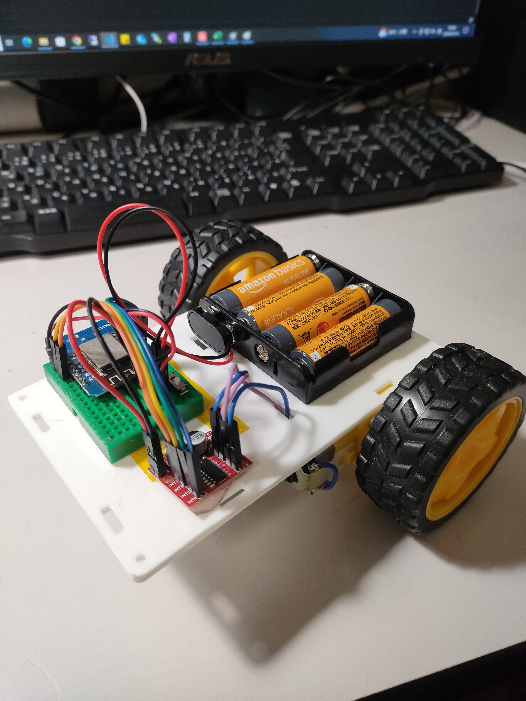

[目次]
- [ロボットカーのデザイン](#ロボットカーのデザイン)
  - [ロボットカーの仕組み](#ロボットカーの仕組み)
    - [2輪型の走行制御](#2輪型の走行制御)
    - [スマホとの連動(RemoteXY)](#スマホとの連動remotexy)
  - [ロボットカーを構成する部品](#ロボットカーを構成する部品)
    - [ESP8266](#esp8266)
    - [L298Nモータードライバ](#l298nモータードライバ)
      - [電源端子](#電源端子)
      - [制御用端子](#制御用端子)
    - [TTモーター＆ホイール](#ttモーターホイール)
    - [電源](#電源)
    - [その他](#その他)
  - [配線図](#配線図)
- [ロボットカーのプログラム](#ロボットカーのプログラム)
  - [リモートコントロール用の画面](#リモートコントロール用の画面)
  - [ロボットカーのプログラム構造の解説](#ロボットカーのプログラム構造の解説)
      - [1. RemoteXYにより生成されたコード](#1-remotexyにより生成されたコード)
      - [2. ライブラリモジュールのインクルード](#2-ライブラリモジュールのインクルード)
      - [3. GPIO番号の定義](#3-gpio番号の定義)
      - [4. 独自関数の定義](#4-独自関数の定義)
      - [5. Arduinoのメイン処理](#5-arduinoのメイン処理)
  - [結論](#結論)


## ロボットカーの仕組み
### 2輪型の走行制御
2個のモーターを使う。
左右の車輪の回転方向を変えることにより、前進・後退・右旋回・左旋回の動きを実現する。

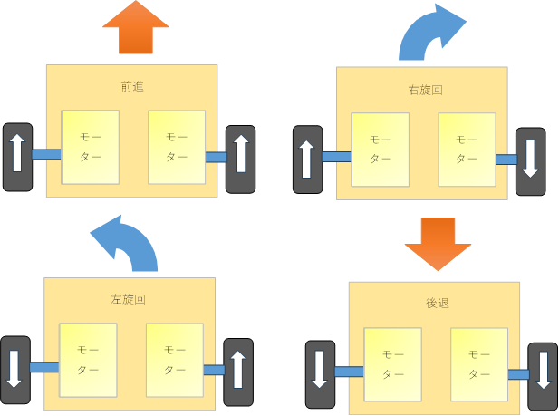

### スマホとの連動(RemoteXY)
スマホとマイコンの連携のためには、[RemoteXY](https://remotexy.com/)というシステムを利用します。
これをつかうことにより、スマホからマイコン(ロボットカー)をリモートコントロールしたり、マイコンからの情報をスマホに表示することができます。


[RemoteXY editor](https://remotexy.com/en/editor/)を使うとWebブラウザ上でスマホのリモートコントロール用画面をドラッグ＆ドロップでデザインできます。
右上の「Get source code」ボタンを押すと、Arduino IDE用のプログラムコードがダウンロードできるので、それをスケッチに貼り付け、独自の処理(モータの制御部分)などを追加することによってスマホと連動するマイコンプログラムが作成できます。


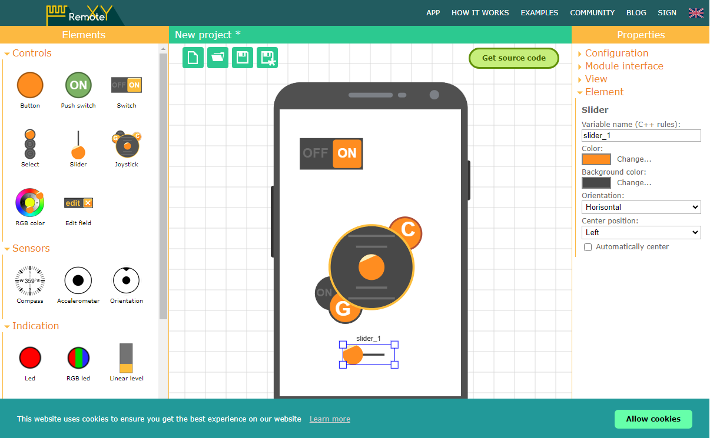

RemoteXYを使うためには、スマホ側にRemoteXYプリをインストールしておく必要があります。


## ロボットカーを構成する部品
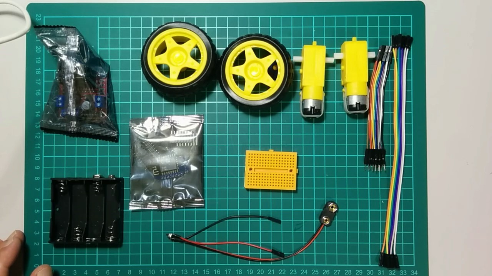

### ESP8266
マイコン
スマホとの無線通信、スマホからの指示を受けて、左右２つのモーターの回転速度や回転の向きを計算します。

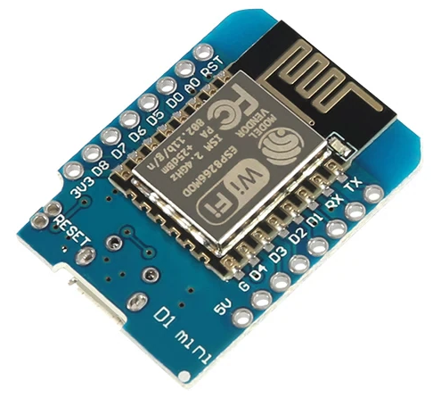

ESP8266には11個のGPIO(入出力端子)があり、プログラムによってコントロール(ON/OFF)することができます。この端子とモータードライバの制御用ピンをつなぐことによってマイコンでモータードライバを制御することができます。

ESP8266はWifiが使えるマイコンとして非常にポピュラーで、人気が高く、制作例たくさんあります。
ESP8266の上位機種としてESP32があります。こちらは使えるGPIOが多いので、ロボットカーを機能アップしてセンサなどを搭載したい場合、便利です。

次のサイト等が参考になります。[RANDOM NERD TUTORIALS](https://randomnerdtutorials.com/)


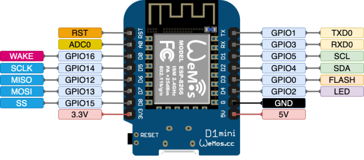

### L298Nモータードライバ

マイコンからの指示でモーターの電圧や電流方向をコントロールします。
通常、モーターは大きな電流が流れるので、マイコンで直接モータを動かすことはできません。そのために、モータードライバというモジュールを使い、モーターを動かします。
マイコンはモータードライバに指示をすることによってモーターを動かします。


L298Nは2個のモータをコントロールすることができます。
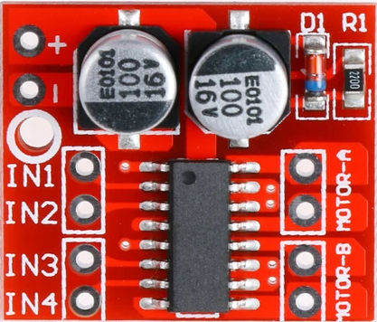

#### 電源端子

電源及びモーターに接続する端子(ターミナルブロック)

|端子|役割|
|----|--------------------|
|MORTOR-A| モーターAを接続します |
|MORTOR-B| モーターBを接続します |
|+|電源の+6Vにつなぎます|
|-|電源のマイナス側につなぎます。またマイコンのGND端子もここにつなぎます｜


#### 制御用端子
4本のピン端子があり、マイコンとつないで2本単位でモーターの速度と回転方向をコントロールします

|端子|役割|
|----|--------------------|
|IN1,IN2| モーターAの方向をコントロールします |
|IN3,IN4| モーターBの方向をコントロールします |

IN1とIN2またはIN3とIN4の組み合わせで回転方向が決まります。
（ここにマイコンの出力をつないで制御します）


|IN1およびIN3|IN2およびIN4|動作|
|-----|----------|-----|
| OFF | OFF|モーター停止|
| ON | OFF | 正転|
| OFF | ON | 逆転|
| ON | ON | モーター停止|

>ON:ピン端子に+3.3Vの電圧をかける  
>OFF:ピン端子を0Vに落とす

IN1とIN2は**PWM制御**と呼ばれる方法で、モーターの速度を変化させることができます。高速でピン端子をON/OFFすることによって、一定時間サイクル内のONの時間幅に応じてモーターの速度を変化させることができます。

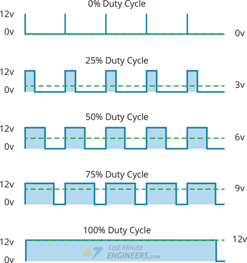

マイコンには、ピン端子をON/OFFしたり、PWM制御を行ったりする機能が備わっており、これを使ってプログラムでモーターの動きをコントロールします。


### TTモーター＆ホイール

車輪を動かすモーターとタイヤです。
一般敵におもちゃなどで使わるれ電池で動くモーターを使っています。

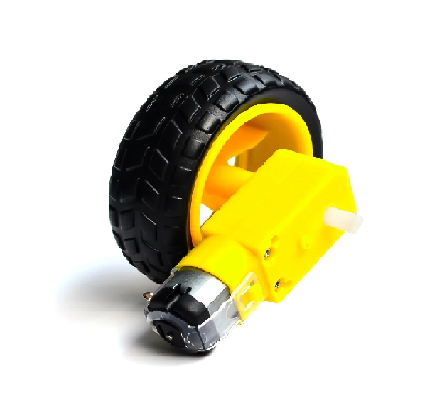

### 電源

電源は単3電池４本を直列につなぎ、6Vの電源を作っています。
L298Nモータードライバには、モーター駆動用の電源から、マイコン用の5Vを取り出す便利な機能がついているので、マイコン用の電源はこれを使っています。
電池ボックスはスナップつきのものを使用し、スナップのリード線の途中に電源スイッチを取り付けています。

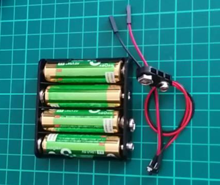

### その他

ブレッドボード
マイコンモジュール(ESP8266)を差し込んで、配線を行うのに使います。


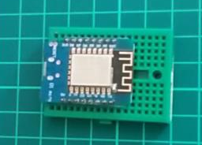


## 配線図

次に示す図が、「ロボットカー」全体の回路図です。
組み立てはリード線の色を合わせるように配線をしてゆきます。

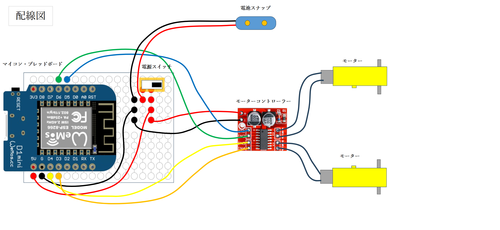

ブレッドボード周辺の拡大

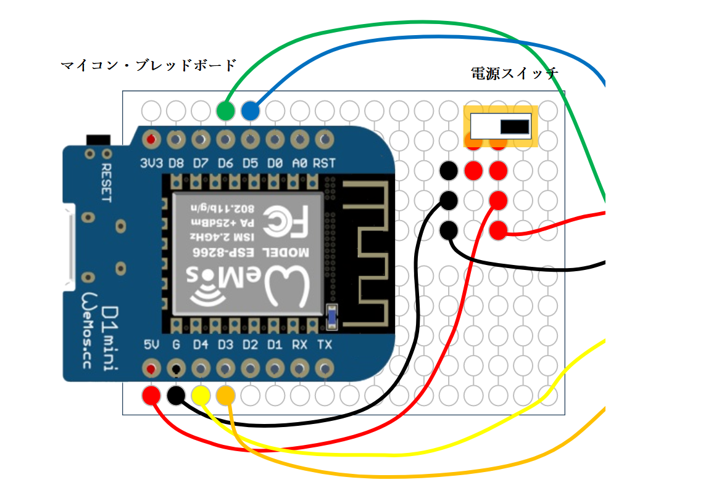


実際に配線すると、次のようになります。

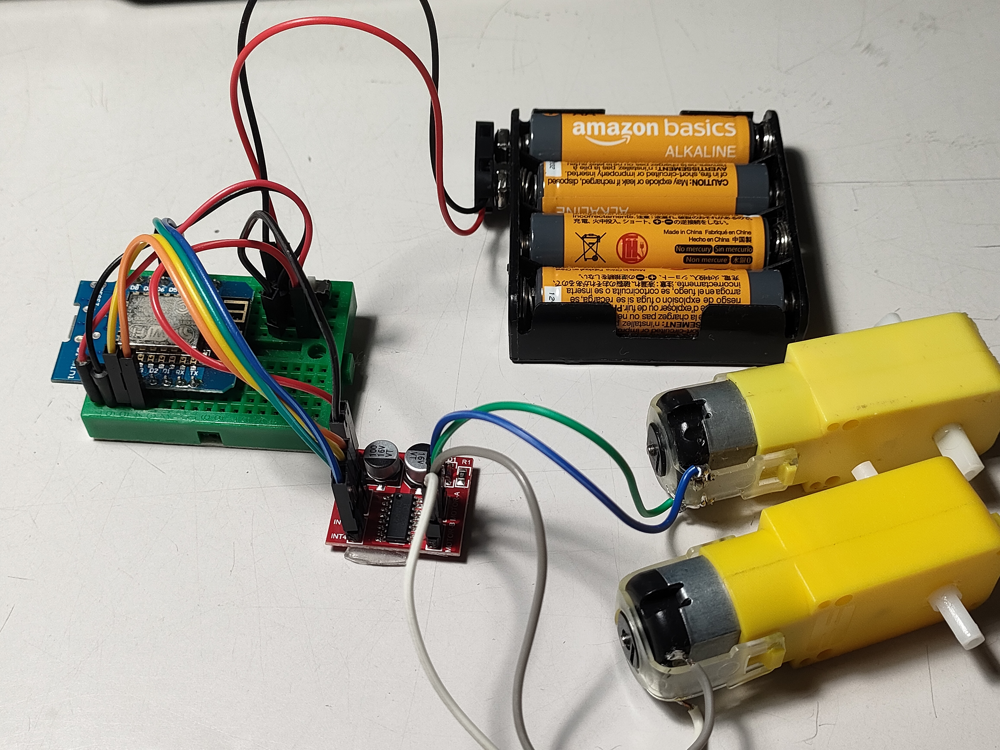


# ロボットカーのプログラム

## リモートコントロール用の画面

[RemoteXY editor](https://remotexy.com/en/editor/)で、このような画面を定義しています。

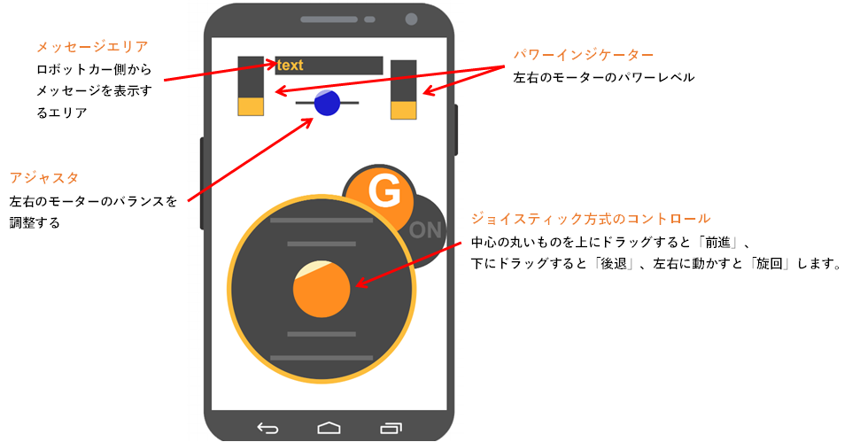

## ロボットカーのプログラム構造の解説

以下で、プログラムの全体的な仕組みについて解説します。
実際にプログラムを触る場合は、最新のプログラムがダウンロードできますのでそちらを確認してください。

[inaba20230806サポートページ](https://github.com/tyamane/inaba20230806)

プログラムは、主に以下のようなパートから構成されています。

1. RemoteXYにより生成されたコード
2. ライブラリモジュールのインクルード
3. GPIO番号の定義
4. 独自関数の定義
5. Arduinoのメイン処理

#### 1. RemoteXYにより生成されたコード
[RemoteXY editor](https://remotexy.com/en/editor/)で、リモートコントロール用のGUIを定義すると、Aruduino IDE用のプログラムコードが作成され、ダウンロードできます。
まずは、スケッチの先頭にこのコードを入れます。

ここは何も考えずに　/* -- RemoteController... ～　// END RemoteXY include ... //の範囲をコピーして貼り付けます。
これによって、スケッチの中で、RemoteXYのGUIの値(ジョイスティックの値やスライダーの値が取得できるように設定されます)　

RemoteXYを使う場合、スマホとの通信処理などはRemotXYが作成したコードを貼り付けるだけで実現されます。あとはモーターを動かす部分など独自処理の所だけプログラムを書けば、プログラムができあがるようになっています。

```
/*
   -- RemoteController --
   
   This source code of graphical user interface 
   has been generated automatically by RemoteXY editor.
   To compile this code using RemoteXY library 3.1.8 or later version 
   download by link http://remotexy.com/en/library/
   To connect using RemoteXY mobile app by link http://remotexy.com/en/download/                   
     - for ANDROID 4.11.1 or later version;
     - for iOS 1.9.1 or later version;
    
   This source code is free software; you can redistribute it and/or
   modify it under the terms of the GNU Lesser General Public
   License as published by the Free Software Foundation; either
   version 2.1 of the License, or (at your option) any later version.    
*/

//////////////////////////////////////////////
//        RemoteXY include library          //
//////////////////////////////////////////////

// RemoteXY select connection mode and include library 
#define REMOTEXY_MODE__ESP8266WIFI_LIB_POINT
#include <ESP8266WiFi.h>

#include <RemoteXY.h>

// RemoteXY connection settings 
#define REMOTEXY_WIFI_SSID "RemoteXY"
#define REMOTEXY_WIFI_PASSWORD "12345678"
#define REMOTEXY_SERVER_PORT 6377


// RemoteXY configurate  
#pragma pack(push, 1)
uint8_t RemoteXY_CONF[] =   // 79 bytes
  { 255,3,0,46,0,72,0,16,31,1,5,37,5,49,51,51,2,26,31,66,
  1,48,6,7,16,2,26,66,1,7,5,7,16,2,26,67,4,17,5,29,
  4,2,26,11,4,160,19,14,24,7,6,26,67,4,8,26,47,4,2,26,
  11,67,4,8,31,47,4,2,26,11,67,4,8,36,47,4,2,26,11 };
  
// this structure defines all the variables and events of your control interface 
struct {

    // input variables
  int8_t joystick_1_x; // from -100 to 100  
  int8_t joystick_1_y; // from -100 to 100  
  int8_t adjust; // =-100..100 slider position 

    // output variables
  int8_t level_right; // =0..100 level position 
  int8_t level_left; // =0..100 level position 
  char text_1[11];  // string UTF8 end zero 
  char text_2[11];  // string UTF8 end zero 
  char text_3[11];  // string UTF8 end zero 
  char text_4[11];  // string UTF8 end zero 

    // other variable
  uint8_t connect_flag;  // =1 if wire connected, else =0 

} RemoteXY;
#pragma pack(pop)

/////////////////////////////////////////////
//           END RemoteXY include          //
/////////////////////////////////////////////

```
#### 2. ライブラリモジュールのインクルード

ここでは、追加で利用するArduinoライブラリを読み込む設定を書きます。
この例では、EPROMライブラリを読み込む用に設定しています。

>EPROMライブラリはArduinoが標準で提供している機能で、電源を切ってもデータを保持できるEPROM機能をプログラムに組み込みます

```
#include <EEPROM.h>
```
#### 3. GPIO番号の定義
マイコンが、モータードライバなどのモジュールと連携するためには、マイコンの入出力端子(GPIO)を使ってデータをやり取りします。そのために、使う端子番号をここで定義しています。

ここで定義した番号と、実際の配線は一致させておく必要があります。そのために、GPIO番号の横に線の色をコメントしてあります。
また、ENAとかIN1,IN2は接続しているモータードライバの制御用ピンの名前です。　プログラムでは、ここで定義している番号を使ってプログラムを書いて行きます。

```
/* defined the right motor control pins */
#define PIN_MOTOR_RIGHT_UP 14  // ①IN1 オレンジ
#define PIN_MOTOR_RIGHT_DN 12  // ②IN2　黄色

/* defined the left motor control pins */
#define PIN_MOTOR_LEFT_UP 0 // ③IN3　緑
#define PIN_MOTOR_LEFT_DN 2 // ④IN4　青
```

#### 4. 独自関数の定義

スマホからの入力データからロボットカーのモーターをどのように動かすか計算するための処理を関数として書いています。
中心となる処理は control_xy()という関数で、スマホのジョイスティックの値から、左右のモータの方向、速度を決めています。

プログラム内に出てくる、次のような命令が、制御用のピンをコントロールしています。

    analogWrite(motor[0], abs(v*2.55));
    analogWrite(motor[1], 0);

  **analogWrite**(_出力するピン番号_, 出力レベル);
  |||
  |--|---|
  |出力するピン番号|ENAまたはENBがつながっているマイコンのGPIO端子の番号を指定します|
  |出力レベル|モータのパワー(速度) を0～255（256段階）で指定します|

```
/* defined two arrays with a list of pins for each motor */
unsigned char RightMotor[3] = 
  {PIN_MOTOR_RIGHT_UP, PIN_MOTOR_RIGHT_DN};
unsigned char LeftMotor[3] = 
  {PIN_MOTOR_LEFT_UP, PIN_MOTOR_LEFT_DN};

// EEPROM保存データ
#define MAGIC_NO (0x12345678L)
struct {
  unsigned long magic_no;
  int8_t adjust; // モータ左右バランス調整
} eeprom_data;

/* defined the LED pin */
#define PIN_LED 2
/*
   speed control of the motor
   motor - pointer to an array of pins
   v - motor speed can be set from -100 to 100
*/

void Wheel (unsigned char * motor, int v)
{
  if (v>100) v=100;
  if (v<-100) v=-100;
  if (v>0) {
    // 正転
    analogWrite(motor[0], abs(v*2.55));
    analogWrite(motor[1], 0);
  }
  else if (v<0) {
    // 逆転
    analogWrite(motor[0], 0);
    analogWrite(motor[1], abs(v*2.55));
  }
  else {
    //停止
    analogWrite(motor[0], 0);
    analogWrite(motor[1], 0);
  }
}

// ジョイスティックコントロール
#define STOP 0
#define FORWARD 1
#define BACK 2
#define RIGHT 3
#define LEFT 4
#define DELAY 5
int control_xy( int x, int y)
{
  static int delay = 0;
  static int state = 0; // 0:stop, 1:Forward, 2:Back, 3:(Turn)Right, 4:(Turn)Left, 5:delay
  static int old_state = 0;
  static unsigned long t = 0;
  int d=0;

  if (t != 0){
    d = millis() - t; // 前回の呼び出しからの経過時間(ミリ秒)
  }
  t = millis(); // 現在時刻
  
  if ( state == DELAY ){
    delay -= d; // 待機時間減算
    if ( delay > 0 ){
      // 待機時間中はモーターを止める
      //Wheel (RightMotor, 0);
      //Wheel (LeftMotor, 0);
      //sprintf(RemoteXY.text_3, "**DELAY**\n");
      return state;
    }
    //sprintf(RemoteXY.text_3, "\n");
    // 待機期間終了
    state = old_state;
  }

  // ジョイスティック指示
  if ( x == 0 && y == 0){
    // ジョイスティックを手放した状態
    state = STOP;
  }
  else{
    if ( y > 30 /*&& abs(x) < 90*/ ){
      state = FORWARD;
    }
    else if ( y < -30 /*&& abs(x) < 90*/ ){
      state = BACK;
    }
    else{
      if (x > 20 ){
        state = RIGHT;
      }
      else if ( x < -20 ){
        state = LEFT;
      }
      else{
        // 微妙なところはモーターだけ止める
        Wheel (RightMotor, 0);
        Wheel (LeftMotor, 0);
        return state;  
      }
    }  
  }
  if ( old_state != state && state != STOP && old_state != STOP){
    // 動作が切り替わるときに0.5秒の待機期間を設ける
    delay = 500;
    old_state = state;
    state = DELAY;
    return state;
  }

  // モーターバランス調整パラメータ
  // eeprom_data.adjust -100 .. +100
  x += (eeprom_data.adjust / 10);
  switch(state){
    case 0: // stop
      delay = 0;
      Wheel (RightMotor, 0);
      Wheel (LeftMotor, 0);
      break;
    case FORWARD:
    case BACK:
      Wheel (RightMotor, y + x/2); // ジョイスティックx方向の影響度を小さくする（曲がりにくい）
      Wheel (LeftMotor, y - x/2);
      break;
    case LEFT:
    case RIGHT:
      Wheel (RightMotor, (y + x) );// 旋回速度を落とす
      Wheel (LeftMotor, (y - x) );
      break;
  }
  old_state = state;
  return state;
}
```
#### 5. Arduinoのメイン処理

Arduinoのプログラムのメイン処理setup()とloop()の処理です。

setup()は初期化処理として、マイコンの電源が投入された時、１回だけ実行されます。
loop()は初期化処理後、電源が切れるまでずっと繰り返し実行されます。

/* initialization pins */のところでは、マイコンのGPIOを出力モード(OUTPUT)に設定しています。これによってマイコンからGPIOで接続されたモータードライバの制御ができるように設定しています。

RemoteXY_Init(); の部分はRemoteXYの通信関連の初期化などの作業が行われます。（その処理の中身はRemoteXYでコピペしたコードで実行されるので詳細は知らなくてもいいです。ただRemotreXY_Init();と書くだけですべてうまくやってくれます。

そのほかは、独自処理のための初期化処理です。

```
  RemoteXY.level_right = 50;
  RemoteXY.level_left = 50;
```
のようなコードはRemoteXYで定義したGUIの初期化を行っている部分です。この例ではGUI画面にある「パワーインジケーター」と呼ばれる部分の値を50(中央値)にセットしています。
プログラムが実行されると、スマホ画面の「パワーインジケーター」のバーが更新されます。

```
void setup() 
{
  Serial.begin(115200);

  /* initialization pins */
  pinMode (PIN_MOTOR_RIGHT_UP, OUTPUT);
  pinMode (PIN_MOTOR_RIGHT_DN, OUTPUT);
  pinMode (PIN_MOTOR_LEFT_UP, OUTPUT);
  pinMode (PIN_MOTOR_LEFT_DN, OUTPUT);
  pinMode (PIN_LED, OUTPUT);
  
  RemoteXY_Init(); 
  
  RemoteXY.level_right = 50;
  RemoteXY.level_left = 50;

  // EEPROM初期化
  EEPROM.begin(sizeof(eeprom_data));
  EEPROM.get(0, eeprom_data);
  if (eeprom_data.magic_no != MAGIC_NO){
    // 保存値を初期化する
    eeprom_data.magic_no = MAGIC_NO;
    eeprom_data.adjust = 0; //center
    EEPROM.put(0, eeprom_data); // EEPROMを更新する
    EEPROM.commit();
  }
  // EEPROMに保存されている値でUIを更新する
  RemoteXY.adjust = eeprom_data.adjust;
}
```

loop()処理では、スマホの画面の値を読み取って、それに応じてモーターの速度と回転方向を調整する処理を行っています。

最初にある RemoteXY_Handler(); の呼び出しで、プログラムとスマホアプリが通信し、GUIの状態を取り込んだり、プログラム設定した値をGUIに表示したりします。この処理もRemoteXYが提供しているもので、中身を知る必要はなく、ただ関数を呼び出せばよい仕組みになっています。
```
void loop() 
{ 
  RemoteXY_Handler ();

  if (RemoteXY.adjust != eeprom_data.adjust){
    eeprom_data.adjust = RemoteXY.adjust;
    EEPROM.put(0, eeprom_data); // EEPROMを更新する
    EEPROM.commit();
    Serial.printf("update %d\n", eeprom_data.adjust);
  }

  //Wheel (RightMotor, RemoteXY.joystick_1_y + RemoteXY.joystick_1_x);
  //Wheel (LeftMotor, RemoteXY.joystick_1_y - RemoteXY.joystick_1_x);

  int state = control_xy(RemoteXY.joystick_1_x, RemoteXY.joystick_1_y);
  sprintf(RemoteXY.text_1, "%s", txt[state]);
  sprintf(RemoteXY.text_2, "%4d %4d\n", RemoteXY.joystick_1_x, RemoteXY.joystick_1_y);

  RemoteXY.level_left = 50 + normalize(RemoteXY.joystick_1_y + RemoteXY.joystick_1_x) / 2;
  RemoteXY.level_right = 50 + normalize(RemoteXY.joystick_1_y - RemoteXY.joystick_1_x) / 2;


}
```

## 結論

いろいろ難しそうなことを並べましたが、やっていることは単純です。
プログラムも一からすべて自分で作る必要はなく。たいていの場合、同じようなことをやっているほかのプロジェクトからコピーすれば事足ります。
みんなそうやってプログラムを作ります。

大事なのは**やりたいこと**、**どうやったらできるか**です。ぜひともプログラミングにチャレンジしてみてください。

