# Arduinoによるプログラム開発の手引き（準備編）
この資料は、「INABA2023 ロボットカー」のプログラミングを行う（プログラム機能を変える）ために必要になるArduino IDEのセットアップについて説明したものです。

- [Arduinoによるプログラム開発の手引き（準備編）](#arduinoによるプログラム開発の手引き準備編)
  - [概要](#概要)
  - [Arduino IDE (プログラム開発ツール)のセットアップ](#arduino-ide-プログラム開発ツールのセットアップ)
    - [プログラミングを始めるための環境準備](#プログラミングを始めるための環境準備)
    - [Arduino IDEのダウンロードとインストール](#arduino-ideのダウンロードとインストール)
  - [「INABA2023 ロボットカー」のプログラミングを行うために特別に必要な設定](#inaba2023-ロボットカーのプログラミングを行うために特別に必要な設定)
  - [Arduino IDE の基本的な使い方](#arduino-ide-の基本的な使い方)
    - [Arduinoボード(マイコン)の接続](#arduinoボードマイコンの接続)
    - [ボード選択](#ボード選択)
    - [プログラムの作成とマイコンボードへの書き込み](#プログラムの作成とマイコンボードへの書き込み)
    - [結論](#結論)

## 概要
「INABA2023 ロボットカー」はArduino(アルディーノ)というコンピュータシステムを使ってプログラミングしています。Arduinoは、たとえば、芸術家や学生など、コンピュータが専門ではない人たちが、自分のアイデアを実現するために専門知識なしで、簡単に利用できるようデザインされたコンピュータシステムです。スマホやパソコンを使って、プログラミングをすることによって簡単に利用できるようになっています。

[Arduino Home](https://www.arduino.cc/)

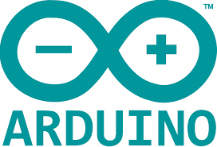

この資料は、以下の内容について説明します。

- Arduino IDE (プログラム開発ツール)のセットアップ

- Arduino IDE の基本的な使い方

- 「INABA2023 ロボットカー」のプログラミングを行うために特別に必要な設定

> Arduinoを使ったプログラム開発は非常にポピュラーであり、インターネット上にもたくさん情報があります。  
>「INABA2023 ロボットカー」固有のこと以外は、インターネット上のサイトをいろいろ検索してみることをお勧めします。  
>（本資料の中でも、参考になるサイトのURLなどを紹介します）

## Arduino IDE (プログラム開発ツール)のセットアップ

Arduinoプログラムを作成したり、作成したプログラムをマイコンに転送したりするためのアプリケーションです。
Arduinoの本家ホームページからダウンロードしてインストールします。

### プログラミングを始めるための環境準備

Arduinoを使ったプログラミングを始めるためには、いくつかのアプリケーション（インターネットで入手できる）と、USBケーブル、そしてパソコンが必要になります。

### Arduino IDEのダウンロードとインストール

1. Arduino本家のソフトウェア配布ページからインストーラをダウンロードします。

[https://www.arduino.cc/en/software](https://www.arduino.cc/en/software)

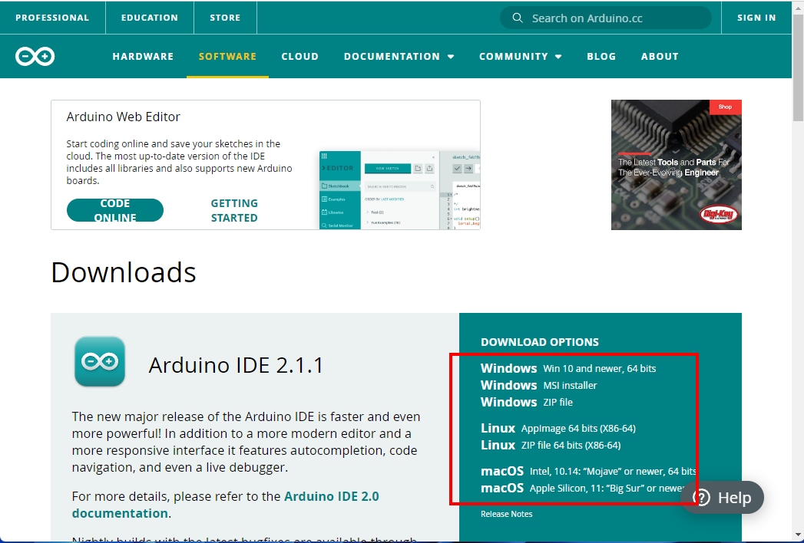

使っているパソコンの種類またはOSに応じてダウンロードしてください。

Windows 10、11パソコンをお使いであれば、「WINDOWS Win 10 and newer, 64bits」でよいでしょう。

次のような画面が出ますので「JUST DOWNLOAD」をクリックしてください。
（CONTRIBUTE & DOWNLOADで Arduinoプロジェクトに貢献(寄付)したい方はCONTRIBUTE...でもいいです。）

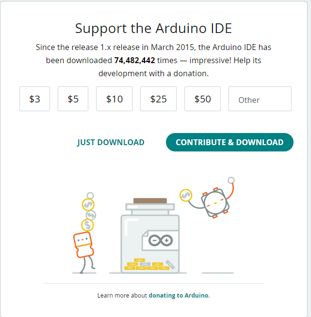

2. Arduino IDEのインストール

ダウンロードしたインストーラーを起動します。

「最初にライセンス契約書」の画面が出ますので、「同意する」ボタンを押し、あと数画面でオプションの設定を行うようになっていますが、特に必要がなければすべて表示された状態のまま「次へ」ボタンで進めてください。

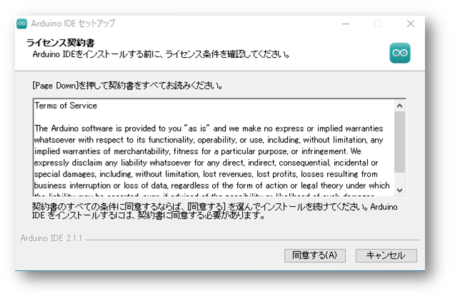

最後に次のような画面が表示されれば、インストールは成功です。

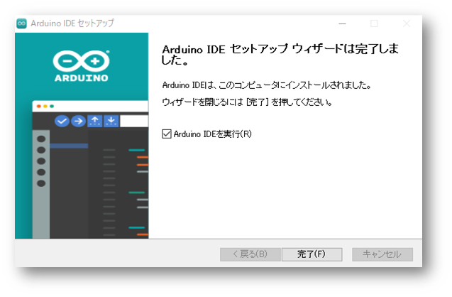

完了ボタンをクリックすると、Arduino IDEが起動します。
（最初の起動は、アップデートなどが実行されるため少し時間がかかります。）

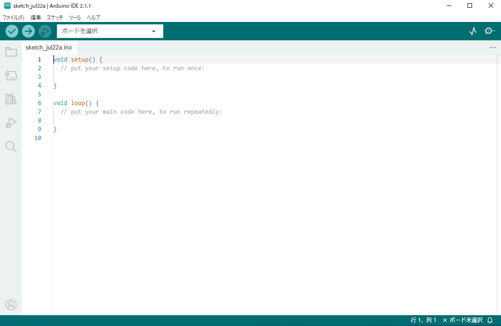

## 「INABA2023 ロボットカー」のプログラミングを行うために特別に必要な設定

Arduino IDEを使って「INABA2023 ロボットカー」のプログラミングを始めるためには、最初にいくつかやっておかなければならないことがあります。

> Arduino IDEはひとつのアプリで様々なタイプのマイコンのプログラミングができるようになっています。
> そのために、「ボードマネージャ」という仕組みで、使用するマイコンを選択できるようになっています。
> Arduino IDEに「INABA2023 ロボットカー」で使っているマイコン(ESP8266)のサポートを追加するためにここで設定を行います。　　
>※標準のArduino IDEにはESP8266のサポートは含まれていません

メニューから「ファイル」-> 「基本設定」をクリックしてください。

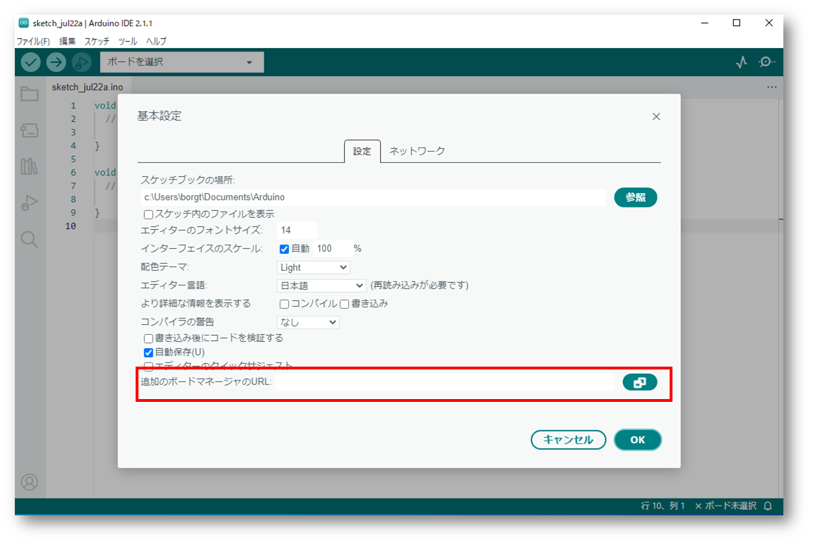

をクリックしてください。

追加のボードマネージャのURLに次のURLを追加して「OK」ボタンをクリック
```
http://arduino.esp8266.com/stable/package_esp8266com_index.json
```

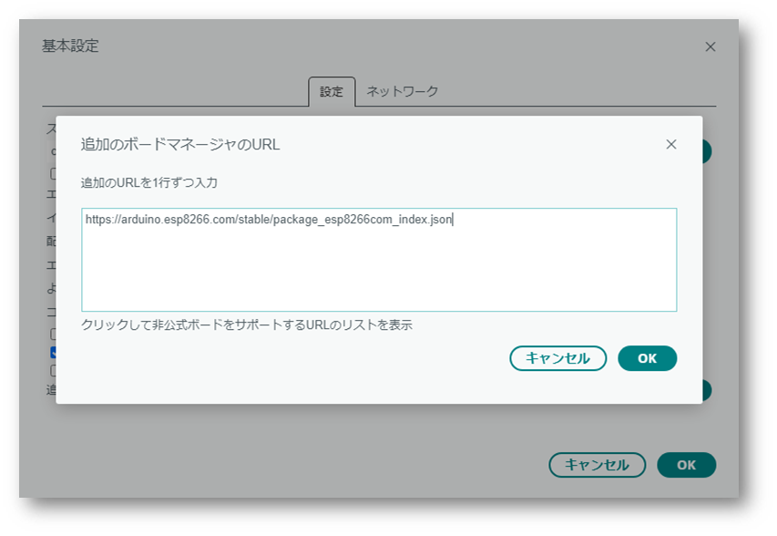

次に

メニューから「ツール」->「ボード」->「ボードマネージャ」をクリックしてください。

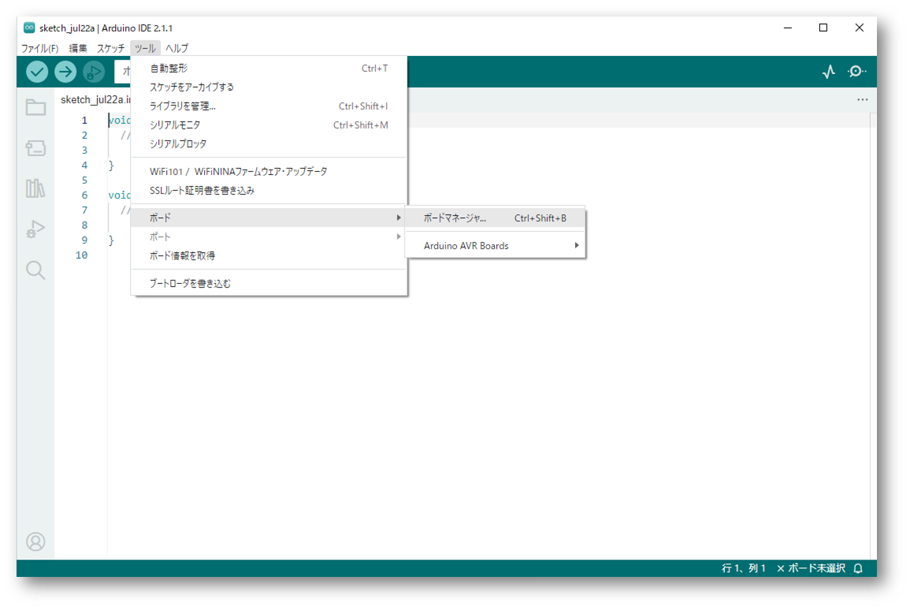

「ボードマネージャー」が開きArduino IDEがサポート可能なボード(マイコン)の一覧が表示されるので、そこからesp8266のボードを見つけて、インストールボタンをクリックしてください。

インストールボタンをクリックすると、esp8266用のサポートファイルがインターネットからダウンロードされ、Arduino IDEに追加されます。

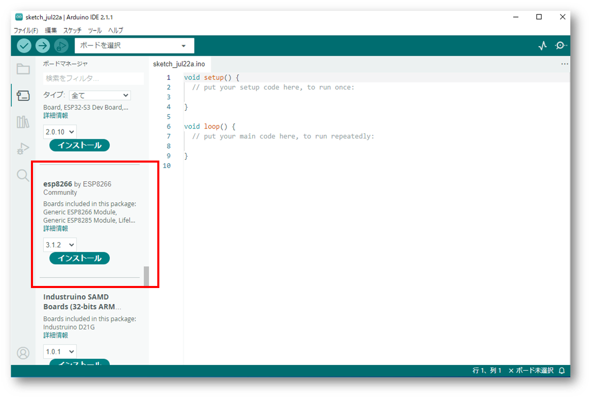

しばらくしてインストールが終われば、「ツール」ー＞「ボード」に「esp8266」が追加されているはずです。

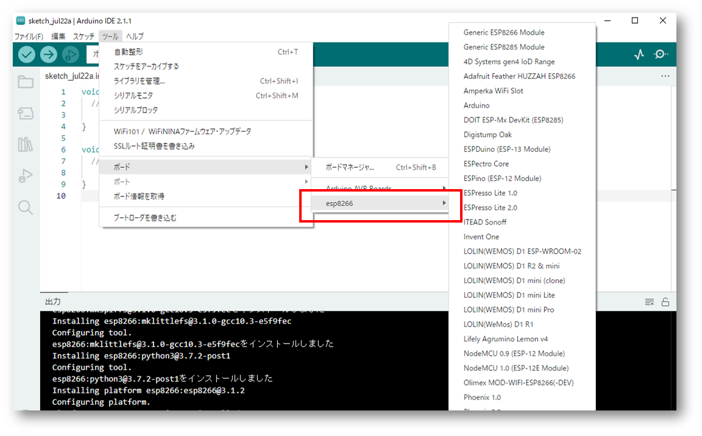


次に

メニューから「ツール」->「ライブラリを管理」->「ライブラリマネージャ」をクリックしてください。

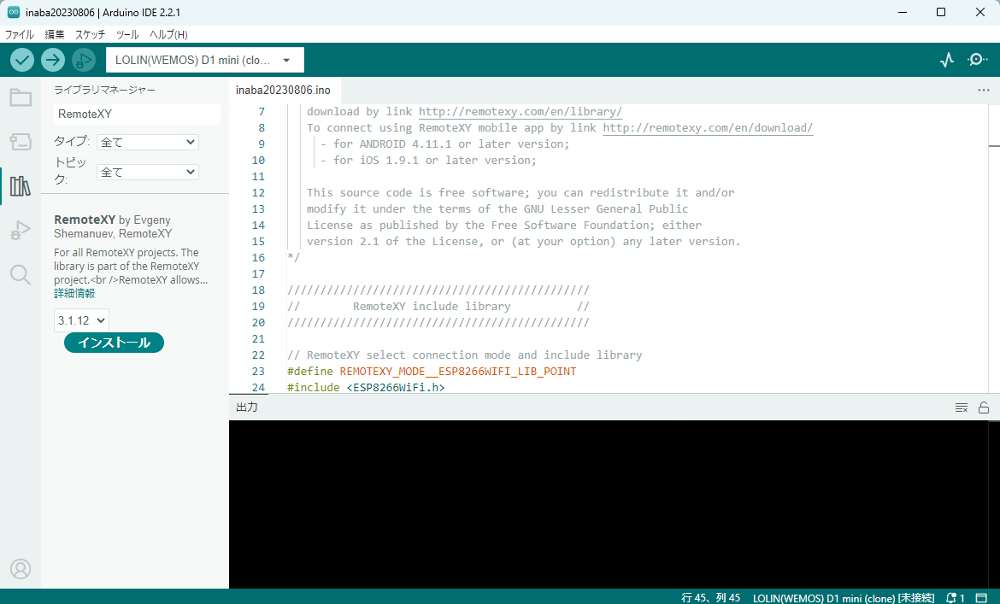

検索ボックスに「RemoteXY」と入力し、インストールボタンを押してください。

必要なライブラリが追加されます。


## Arduino IDE の基本的な使い方

セットアップが完了すると、このような画面が表示されているはずです。

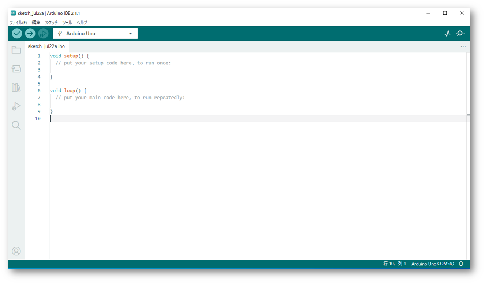

この部分が、テキストエディタになっており、ここにプログラムを書いていきます。
最初は、何もしない(BLANK)と呼ばれるプログラムが設定されています。
このテキストを修正して、自分の好きな処理を追加していくことになります。

Arduinoではテキストで書かれたプログラムコードのことを「スケッチ」と呼びます。

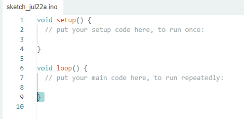

### Arduinoボード(マイコン)の接続

プログラムを作成するターゲットとなる「マイコン」をUSBケーブルで接続します。

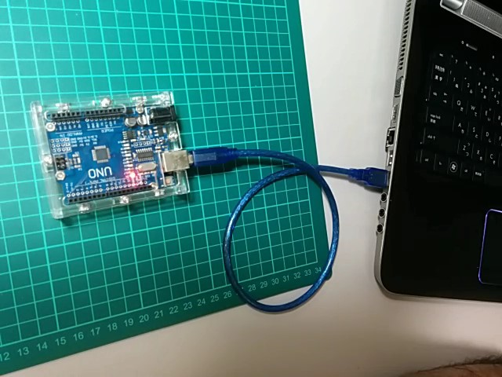

Arduino IDEによって「マイコン」が正しく認識されていれば、Arduino IDEの右下に、COMポート(シリアルポートの番号が表示されているはずです)

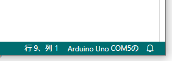 この場合はCOM5としてArduinoボード(マイコン)が認識されています。

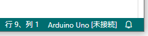 のように「未接続」と表示された場合は、ポート番号を調整する必要があります。

この場合には、メニューから「ツール」-> 「ポート」を選択してください。
Arduino IDEが認識しているシリアルポートの番号(この場合はCOM4)が表示されているはずなので、そこから選択してください。

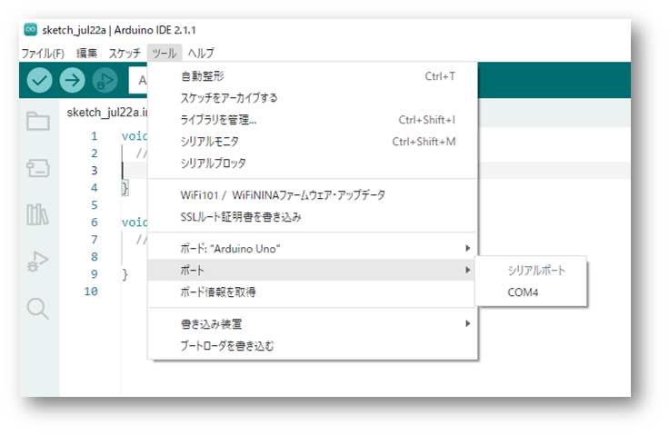

### ボード選択

次に、ボードの選択を行います。
Arduino IDEは様々なマイコン(ボード)に対応しているので、使用するマイコンに選択する必要があります。
使用するボードによってはポート(シリアルポート)を選択するだけで適切なボードを設定してくれる場合もありますが、必ず確認して違っていれば選択しなおしましょう。

>一度正しく選択すれば、作成したスケッチ(プログラムコード)を保存する際にその設定も一緒に保存されるので、改めて選択しなおす必要はありません。

ボードを選択するには、メニューから「ツール」->「ボード」のメニューをたどり、リストの中から使用するボードの種類を選択します。

この場合は「Arduino UNO」が選択されています。

利用するマイコンボードがリストにない場合もあります。
その場合には、「ボードマネージャ」の機能を使い、そのマイコンボードのサポートをArduino IDEに追加します。

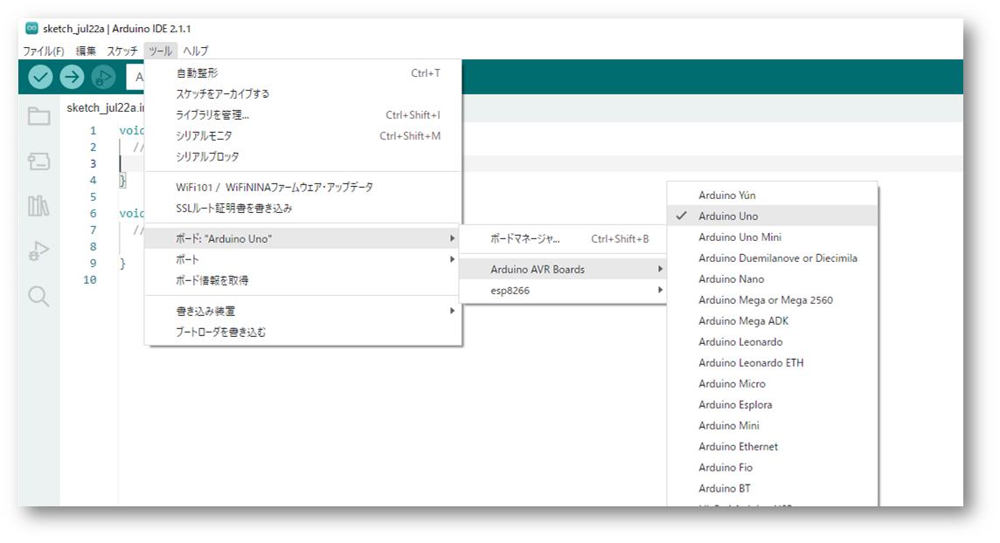

### プログラムの作成とマイコンボードへの書き込み

これで、プログラムを作成してマイコンに書き込みする準備が整いました。
本来は、テキストエディタの部分でスケッチを編集し、目的の機能を持ったプログラムを書き込みますが、とりあえず何もしない(BLANK)のプログラムをマイコンに書き込んでみましょう。

ツールバーにある書き込みボタンをクリックします。

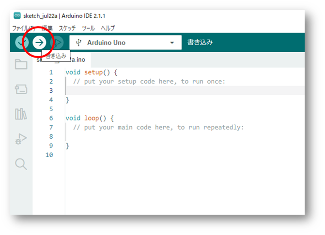

スケッチの検証とコンパイルが実行され、プログラムの問題がなければマイコンにプログラムが書き込まれます。
プログラムに問題があったり、接続がうまくいっていない場合はエラーメッセージが表示されます。

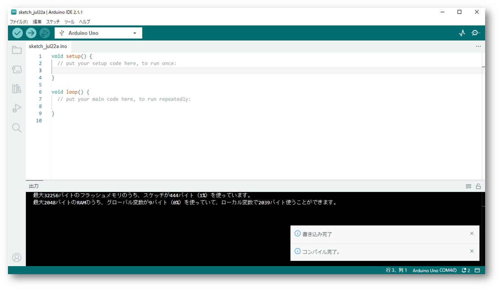

書き込みが正常に行われたら、マイコンが自動的にリセットされて、新しいプログラムが実行されます。

おめでとうございます！あなたは最初のプログラムをマイコンに書き込み、実行することができました。

### 結論

以上で、「INABA2023 ロボットカー」のプログラムを作成するためのArduino IDEのセットアップと基本的な使い方を説明しました。

これであなたもArduinoを使って、自分のアイデアをロボットカーに実現するための第一歩を踏み出すことができるでしょう。

次回の資料では、実際にロボットカーのプログラムを作成していく手順を詳しく説明しますので、楽しみにしていてください！